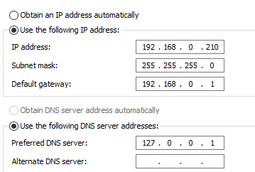
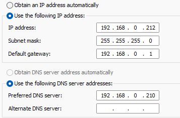
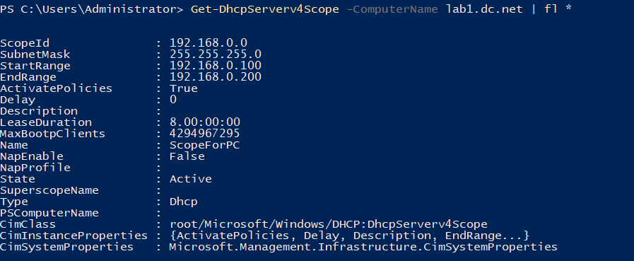

# Windows Server Lab - DHCP & DNS Setup

This document describes the DHCP and DNS configuration in my Windows Server lab environment.

---

## 1. Lab Setup

The lab consists of three Windows machines:

| Machine             | Role / Notes                           |
|--------------------|----------------------------------------|
| **WindowsServer**   | Domain Controller + DHCP + DNS server  |
| **Windows11** | Client 1                                      |
| **Windows11 2** | Client 2 (snapshot reverted to pre-install) |

---

## 2. IP & DNS Configuration

### 2.1 WindowsServer

- Static IP: `192.168.0.210`  
- Subnet Mask: `255.255.255.0`  
- Default Gateway: `192.168.0.1`  
- DNS Server: `127.0.0.1` (loopback to itself)  

> This server hosts both **DHCP and DNS services**.

---

### 2.2 ClientWindows11

- Currently static IP: `192.168.0.212`  
- Subnet Mask: `255.255.255.0`  
- Default Gateway: `192.168.0.1`   
- DNS Server: `192.168.0.210`

> If set to **obtain IP automatically**, DHCP server will assign an address from the configured scope.  

---

### 2.3 ClientWindows11 2

- Static IP: `192.168.0.211`  
- Subnet Mask: `255.255.255.0`  
- Default Gateway: `192.168.0.1`  
- DNS Server: `192.168.0.210`  

> Snapshot was reverted to pre-install state, so no screenshots are available, but configuration is consistent with the lab setup.

---

## 3. DHCP Scope

- Scope configured on **WindowsServer**:

| Scope Name | Start IP      | End IP        | Subnet Mask     | DNS Server      |
|------------|---------------|---------------|----------------|----------------|
| LabScope   | 192.168.0.100 | 192.168.0.150 | 255.255.255.0  | 192.168.0.210  |

- **Leases**: currently only two leases exist, because the clients are using static IPs.
- **Notes**: Leases will populate once clients switch to DHCP (automatic IP).

---

## 4. Notes

- DHCP scope defines the **range of IPs that can be assigned dynamically**.  
- DNS on the server points to itself (`127.0.0.1`), ensuring proper domain name resolution for clients.  
- Static IPs on clients are currently used for testing, but switching to DHCP will allow automatic assignment within the scope.

---

*This lab setup is for learning purposes only and not intended for production.*
