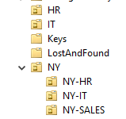
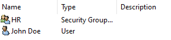
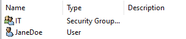
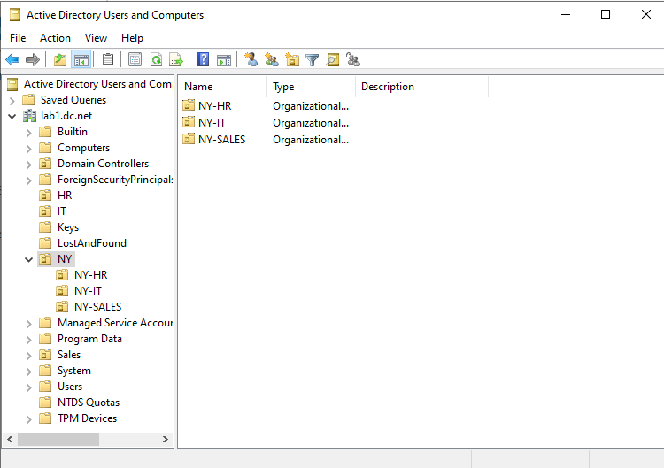

# Windows Server Active Directory Lab - OU Setup

This document describes how I set up Organizational Units (OUs) and users in my Windows Server lab environment.

## 1. Organizational Unit Structure

I created the following OUs in **Active Directory**:

- Enabled **Recycle Bin** for AD to allow restoring deleted OUs and objects.
- Created **Security Groups** for `HR` and `IT` departments.
- Added users to respective OUs and groups:
  - **John Doe** → NY-HR
  - **Jane Doe** → NY-IT

## 2. Steps to Create OU and Users

1. Open **Active Directory Users and Computers** (ADUC).
2. Enable **Advanced Features** via `View → Advanced Features` (required to manage some properties like accidental deletion protection).
3. Right-click the domain → **New → Organizational Unit** → name it (`HR` or `NY`).
4. For nested OUs (NY-HR, NY-IT, NY-SALES):
   - Right-click **NY** → **New → Organizational Unit** → set name.
5. Optional: Uncheck **Protect object from accidental deletion** if you want to allow deleting/restoring later.

   
7. Enable **Active Directory Recycle Bin** to recover deleted OUs if needed:
   - Open **AD Administrative Center → Enable Recycle Bin**.
8. Create **Security Groups**:
   - Right-click domain → **New → Group**
   - Name them `HR` and `IT`
   - Set group scope and type (Global, Security)
9. Create Users:
   - Right-click the appropriate OU → **New → User**
   - Add `John Doe` to NY-HR
   - Add `Jane Doe` to NY-IT

  
  
     
10. Assign users to Security Groups:
   - Right-click user → **Add to a group** → choose HR or IT

 

## 3. Notes

- This lab environment was built for **learning AD administration** and practicing OU, user, and group management.
- All operations were performed manually to simulate **real-world sysadmin tasks**.
- Nested OUs allow easy delegation and permission management per department.

---

*This lab setup is for learning purposes only and is not intended for production.*
