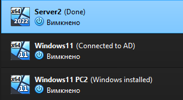
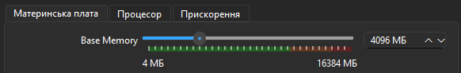
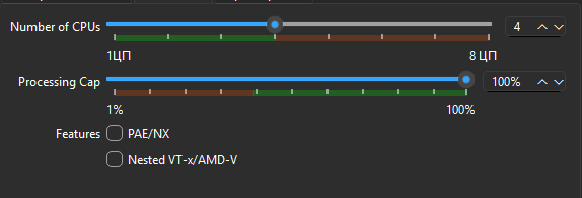
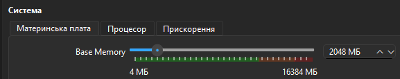
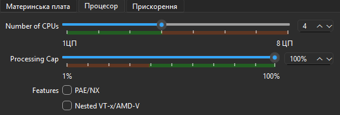

# VM Setup for Windows Server Lab

This document describes how I set up the virtual machines for my Windows Server lab.

## 1. Downloading ISOs
- Downloaded **Windows Server Evaluation** and **Windows 11 Evaluation** from the official Microsoft website.
- These ISOs were used to create the lab environment in VirtualBox.

## 2. Creating Virtual Machines
- Created three virtual machines in VirtualBox:
  - **Windows Server VM** (for Domain Controller)
  - **Windows 11 VM** (as a client)
  - **Windows 11 VM** (as a second client)

- Allocated basic resources:

  CPU: 4 cores each

    **Server:**
  - RAM: 4 GB
  - Disk: 50 GB
    
    
     
 
    **Client:**
  - RAM: 2 GB 
  - Disk: 50 GB

     
     

## 3. Network Configuration
- Initially tried **internal network**, but it was inconvenient for me due to no internet access, but it was ready to use.
- Switched to **bridged network connection** so both VMs could access the internet and communicate with each other.

## 4. Installation Notes
- Installed Windows Server first, added **Active Directory Domain Services (AD DS)** role.
- Installed Windows 11 client and joined it to the domain later.
- All configuration was done manually to practice real sysadmin tasks.

---

*This lab setup is for learning purposes only and not intended for production.*
